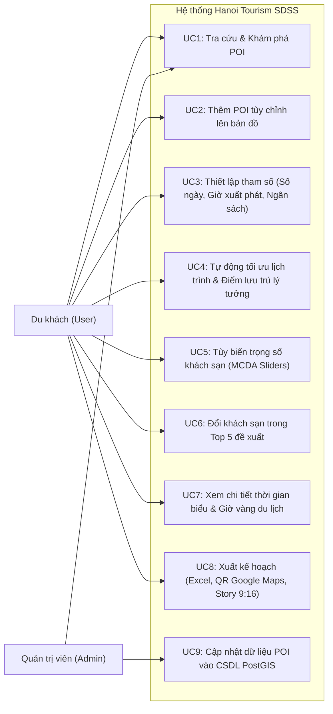
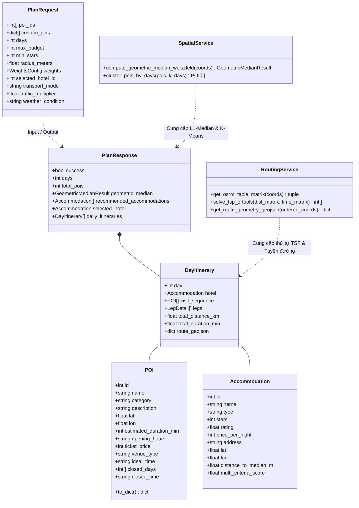
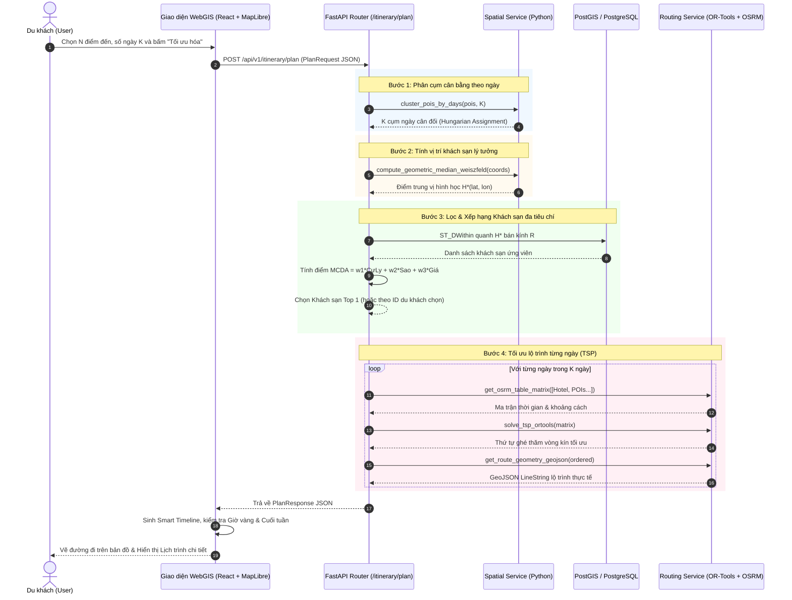
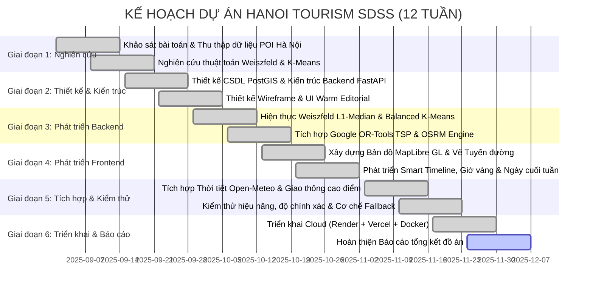

# TRƯỜNG ĐẠI HỌC PHENIKAA
## KHOA CÔNG NGHỆ THÔNG TIN
***

# BÁO CÁO ĐỒ ÁN LIÊN NGÀNH (MÃ MÔN: CSE703014)

### ĐỀ TÀI:
## HỆ THỐNG WEBGIS HỖ TRỢ RA QUYẾT ĐỊNH KHÔNG GIAN (SDSS) TỐI ƯU HÓA LỊCH TRÌNH VÀ VỊ TRÍ LƯU TRÚ DU LỊCH TẠI THỦ ĐÔ HÀ NỘI
*(Hanoi Tourism SDSS — Spatial Decision Support System for Travel Itinerary & Accommodation Optimization)*

**Nhóm thực hiện:** Nhóm Đồ án Liên ngành CNTT  
**Giảng viên hướng dẫn:** Giảng viên phụ trách môn học CSE703014  
**Thời gian thực hiện:** Năm học 2025 – 2026  

---

## BẢNG PHÂN CÔNG THỰC HIỆN ĐỒ ÁN

| STT | Mã sinh viên | Họ và tên | Lớp | Nhiệm vụ chính được phân công | Mức độ hoàn thành |
| :---: | :---: | :--- | :---: | :--- | :---: |
| 1 | *<MSSV 1>* | *<Họ và tên SV 1>* | K16-CNTT | **Trưởng nhóm & Kiến trúc sư hệ thống (System Architect):** Khảo sát bài toán không gian; Nghiên cứu và hiện thực thuật toán Weiszfeld L1-Median và Balanced K-Means; Xây dựng tài liệu kiến trúc. | 100% |
| 2 | *<MSSV 2>* | *<Họ và tên SV 2>* | K16-CNTT | **Kỹ sư Backend & Cơ sở dữ liệu Không gian:** Thiết kế cơ sở dữ liệu PostGIS; Lập trình RESTful API bằng FastAPI; Tích hợp Google OR-Tools TSP và máy chủ định tuyến OSRM; Triển khai CI/CD Render Cloud. | 100% |
| 3 | *<MSSV 3>* | *<Họ và tên SV 3>* | K16-CNTT | **Kỹ sư Frontend & WebGIS UI/UX:** Xây dựng giao diện React 18, TypeScript, Tailwind CSS; Tích hợp bản đồ MapLibre GL; Thiết kế hệ thống Smart Timeline và Động cơ Ngữ cảnh (Thời tiết & Giao thông cao điểm). | 100% |
| 4 | *<MSSV 4>* | *<Họ và tên SV 4>* | K16-CNTT | **Kiểm thử & Đảm bảo chất lượng (QA/QC):** Kiểm thử tự động thuật toán; Thử nghiệm dữ liệu thực tế tại Hà Nội; Viết kịch bản kiểm thử; Xây dựng tính năng xuất Excel/Story Card và viết Báo cáo tổng kết. | 100% |

---

## MỤC LỤC

1. [Giới thiệu](#1-giới-thiệu)  
   1.1 [Đặt vấn đề](#11-đặt-vấn-đề)  
   1.2 [Các giải pháp đã có và hạn chế](#12-các-giải-pháp-đã-có-và-hạn-chế)  
   1.3 [Giải pháp đề xuất](#13-giải-pháp-đề-xuất)  
2. [Thiết kế và triển khai](#2-thiết-kế-và-triển-khai)  
   2.1 [Các yêu cầu chức năng (Functional Requirements)](#21-các-yêu-cầu-chức-năng)  
   2.2 [Các yêu cầu phi chức năng (Non-Functional Requirements)](#22-các-yêu-cầu-phi-chức-năng)  
   2.3 [Các ràng buộc (Constraints)](#23-các-ràng-buộc)  
       2.3.1 [Các ràng buộc về triển khai](#231-các-ràng-buộc-về-triển-khai)  
       2.3.2 [Các ràng buộc kinh tế](#232-các-ràng-buộc-kinh-tế)  
       2.3.3 [Các ràng buộc về đạo đức & pháp lý](#233-các-ràng-buộc-về-đạo-đức--pháp-lý)  
   2.4 [Mô hình hệ thống / Thiết kế giải pháp](#24-mô-hình-hệ-thống--thiết-kế-giải-pháp)  
       2.4.1 [Các kịch bản của hệ thống (Use-cases)](#241-các-kịch-bản-của-hệ-thống-use-cases)  
       2.4.2 [Mô hình Use-case tổng quát](#242-mô-hình-use-case)  
       2.4.3 [Mô hình lớp và cấu trúc dữ liệu](#243-mô-hình-lớp-và-đối-tượng)  
       2.4.4 [Các biểu đồ tuần tự (Sequence Diagrams)](#244-các-biểu-đồ-tuần-tự)  
       2.4.5 [Các màn hình giao diện người dùng](#245-các-màn-hình-giao-diện-người-dùng)  
3. [Một số thành phần khác của đồ án](#3-một-số-thành-phần-khác-của-đồ-án)  
   3.1 [Kế hoạch dự án (Project Plan & Gantt Chart)](#31-kế-hoạch-dự-án)  
   3.2 [Đảm bảo thực hiện đúng làm việc nhóm (Teamwork Assurance)](#32-đảm-bảo-thực-hiện-đúng-làm-việc-nhóm)  
   3.3 [Các vấn đề về đạo đức và làm việc chuyên nghiệp](#33-các-vấn-đề-về-đạo-đức-và-làm-việc-chuyên-nghiệp)  
   3.4 [Tác động xã hội và môi trường](#34-tác-động-xã-hội)  
   3.5 [Kế hoạch tiếp thu kiến thức mới và chiến lược học tập](#35-kế-hoạch-cho-kiến-thức-mới-và-chiến-lược-học-tập)  
4. [Kết luận và hướng phát triển](#4-kết-luận)  
5. [Tài liệu tham khảo](#5-tài-liệu-tham-khảo)  

---

# 1. Giới thiệu

## 1.1 Đặt vấn đề
Thủ đô Hà Nội là trung tâm chính trị, văn hóa và du lịch hàng đầu của Việt Nam với hơn 1.000 năm lịch sử văn hiến. Hàng năm, thành phố đón hàng chục triệu lượt du khách trong và ngoài nước. Đặc trưng không gian du lịch của Hà Nội là mật độ điểm đến (Points of Interest - POI) phong phú nhưng phân bố phi tập trung thành các cụm văn hóa lịch sử đặc thù:
- Cụm di sản Lõi Phố Cổ & Hồ Hoàn Kiếm (Quận Hoàn Kiếm)
- Cụm chính trị - danh thắng Ba Đình & Hồ Tây (Quận Ba Đình, Tây Hồ)
- Cụm văn hóa - giáo dục Văn Miếu & Đống Đa (Quận Đống Đa)
- Cụm bảo tàng & đô thị phía Tây (Quận Cầu Giấy, Nam Từ Liêm)
- Các làng nghề truyền thống và danh thắng ngoại thành (Bát Tràng, Đường Lâm, Chùa Hương...)

Tuy nhiên, trong quá trình lập kế hoạch du lịch tự túc, đại đa số du khách hiện nay gặp phải **nghịch lý di chuyển zíc-zắc (The Zigzag Itinerary Dilemma)**:
1. **Đặt phòng khách sạn theo cảm tính:** Du khách thường lựa chọn khách sạn dựa trên quảng cáo hoặc giá rẻ ngẫu nhiên tại các khu vực ngoại vi (như Cầu Giấy, Mỹ Đình, Hà Đông) trước khi lên danh sách tham quan, khiến khách sạn trở thành "nút thắt cổ chai" cách xa các cụm điểm lõi.
2. **Lên lịch trình tùy tiện không tính đến cự ly:** Du khách gom các điểm đến vào cùng một ngày dựa trên sở thích mà không đánh giá sự liền kề không gian, dẫn đến việc di chuyển con thoi qua lại giữa các quận.
3. **Xung đột nghiêm trọng với giao thông và quy chuẩn đô thị Hà Nội:**
   - Các trục đường chính (Kim Mã, Đê La Thành, Chùa Bộc, Cầu Giấy) thường xuyên ùn tắc nghiêm trọng vào giờ cao điểm (07:30 - 09:00 và 17:00 - 19:00).
   - Tuyến phố đi bộ quanh Hồ Hoàn Kiếm cấm toàn bộ phương tiện cơ giới vào dịp cuối tuần (từ 19:00 Thứ Sáu đến 24:00 Chủ Nhật).
   - Các di tích lớn có lịch đóng cửa định kỳ (ví dụ: Lăng Bác đóng cửa vào Thứ Hai và Thứ Sáu).

Hậu quả là du khách lãng phí **40% – 60% thời gian hữu ích** chỉ để ngồi trên xe taxi/xe máy, gia tăng mệt mỏi thể lực, tốn kém chi phí nhiên liệu và làm gia tăng áp lực khí thải nhà kính lên môi trường đô thị.

## 1.2 Các giải pháp đã có và hạn chế

| Nhóm giải pháp | Đại diện tiêu biểu | Ưu điểm | Hạn chế then chốt đối với bài toán du lịch |
| :--- | :--- | :--- | :--- |
| **Bản đồ số & Điều hướng dẫn đường** | Google Maps, Apple Maps, OpenStreetMap | Dữ liệu giao thông trực tiếp, chỉ đường từng chặng (Point-to-point) chính xác. | Không hỗ trợ giải bài toán quy hoạch tổng thể: Không thể tự động tìm vị trí lưu trú tối ưu cho một tập hợp $N$ điểm đến; không tự động phân cụm cân bằng số ngày; chỉ cho phép người dùng kéo thả thủ công. |
| **Nền tảng đặt phòng trực tuyến (OTA)** | Booking.com, Agoda, Traveloka | Bộ lọc giá phòng, hạng sao và review phong phú. | Hoàn toàn tách rời khỏi lịch trình tham quan: Du khách phải tự phán đoán xem khách sạn có thuận tiện cho hành trình hay không. |
| **Ứng dụng gợi ý tour & vé tham quan** | Klook, TripAdvisor, Tour truyền thống | Có danh sách các tour định sẵn. | Lịch trình cứng nhắc, không cá nhân hóa; các tour trọn gói thường ép khách theo khung giờ cố định và ghé các điểm mua sắm thương mại. |
| **Nghiên cứu học thuật về SDSS** | Các bài báo về GIS du lịch | Ứng dụng lý thuyết tối ưu hóa tổ hợp. | Đa phần chỉ dừng lại ở mô hình toán lý thuyết trên máy tính; giao diện thô sơ, thiếu tích hợp ngữ cảnh thời gian thực (thời tiết, giờ vàng, quy định phố đi bộ cuối tuần). |

## 1.3 Giải pháp đề xuất

Nhóm nghiên cứu đề xuất xây dựng hệ sinh thái **Hanoi Tourism SDSS** (Spatial Decision Support System) — một giải pháp WebGIS hoàn chỉnh, tích hợp Trí tuệ Không gian và Tối ưu hóa Vận trù học với quy trình tự động hóa khép kín:

```
[Danh sách POIs mong muốn] 
       │
       ▼
1. Balanced Capacity-Constrained K-Means (Phân cụm ngày cân đối, Hungarian Bipartite Matching)
       │
       ▼
2. Weiszfeld L1-Median Optimization (Tìm tọa độ khách sạn lý tưởng kháng ngoại lai H*)
       │
       ▼
3. Spatial MCDA & PostGIS ST_DWithin (Truy vấn & xếp hạng đa tiêu chí khách sạn thực tế)
       │
       ▼
4. Google OR-Tools TSP & OSRM Engine (Định tuyến vòng kín ngắn nhất xuất phát từ khách sạn)
       │
       ▼
5. Context-Aware Dynamic Engine (Tích hợp Thời tiết Open-Meteo & Giờ cao điểm Hà Nội)
       │
       ▼
6. Smart Chronological Timeline (Tự động lồng giờ xuất phát, giờ ăn trưa, giờ vàng check-in)
       │
       ▼
[Trực quan hóa Bản đồ WebGIS MapLibre GL • Xuất Excel • QR Code Google Maps • Story 9:16]
```

---

# 2. Thiết kế và triển khai

## 2.1 Các yêu cầu chức năng (Functional Requirements - FR)

- **FR1 (Quản lý & Tra cứu POI không gian):** Hệ thống cung cấp cơ sở dữ liệu các điểm đến tiêu biểu tại Hà Nội (Di tích lịch sử, Văn hóa nghệ thuật, Ẩm thực truyền thống, Quán cà phê hoài niệm, Đại siêu thị/TTTM). Cho phép tìm kiếm theo tên, lọc theo phân loại, xem chi tiết tọa độ, giá vé, giờ mở cửa và khung giờ vàng.
- **FR2 (Thêm POI tùy chỉnh từ người dùng):** Cho phép du khách click trực tiếp trên bản đồ hoặc nhập tọa độ để thêm bất kỳ điểm đến cá nhân nào (nhà người thân, quán ăn yêu thích) vào bài toán tối ưu.
- **FR3 (Phân cụm cân bằng ngày - Balanced K-Means):** Tự động phân chia $N$ điểm tham quan thành $K$ ngày du lịch sao cho các điểm trong cùng 1 ngày gần nhau nhất về địa lý, đồng thời số lượng điểm giữa các ngày là đồng đều tuyệt đối (chênh lệch tối đa 1 điểm).
- **FR4 (Xác định vị trí lưu trú lý tưởng - Fermat-Weber):** Tự động tính toán điểm trung tâm không gian $H^*(lat, lon)$ tối ưu hóa tổng quãng đường di chuyển bằng thuật toán lặp Weiszfeld ($L_1$-Median), loại trừ triệt để sự sai lệch của trọng tâm trung bình cộng khi có điểm tham quan ở ngoại thành.
- **FR5 (Truy vấn & Chấm điểm đa tiêu chí Khách sạn - Spatial MCDA):** Quét các khách sạn thực tế trong bán kính $R$ quanh $H^*$ bằng PostGIS `ST_DWithin`, xếp hạng Top 5 dựa trên hàm chấm điểm tổng hợp (Cự ly, Hạng sao, Giá phòng). Cho phép du khách tùy chỉnh trọng số $w_1, w_2, w_3$.
- **FR6 (Định tuyến lộ trình vòng kín - Closed-Loop TSP):** Với mỗi ngày, hệ thống giải bài toán Người du lịch vòng kín (xuất phát từ khách sạn $\rightarrow$ ghé qua các POI đúng 1 lần $\rightarrow$ trở về khách sạn nghỉ ngơi) bằng Google OR-Tools và ma trận thời gian thực OSRM.
- **FR7 (Động cơ ngữ cảnh thời gian thực - Context-Aware Engine):** Tự động truy vấn thời tiết Hà Nội (Open-Meteo API: nhiệt độ, mưa, nắng gắt) và mô phỏng giao thông giờ cao điểm để đưa ra cảnh báo và khuyến nghị thích ứng lộ trình.
- **FR8 (Lịch biểu thông minh & Khung giờ vàng - Smart Timeline):** Cho phép chọn giờ khởi hành (`07:30`, `08:00`, `08:30`, `09:00`), tự động tính toán giờ đến, giờ rời đi, lồng khung giờ ăn trưa ẩm thực Hà Nội (11:45 - 13:00) và gắn nhãn "Giờ vàng check-in" (Hoàng hôn Hồ Tây, Viếng Lăng Bác sáng sớm, Đêm Phố Cổ...).
- **FR9 (Thích ứng ngày trong tuần vs Cuối tuần):** Tự động nhận diện Thứ mấy trong tuần dựa trên ngày khởi hành du khách chọn:
  - Cảnh báo Phố đi bộ Hồ Gươm cấm xe sau 19h tối Thứ 6 đến hết Chủ Nhật.
  - Cảnh báo Lăng Bác đóng cửa viếng vào Thứ Hai & Thứ Sáu.
  - Gợi ý Chợ đêm Phố Cổ hoạt động vào tối cuối tuần.
- **FR10 (Xuất kế hoạch du lịch đa định dạng):** Xuất toàn bộ kế hoạch ra file Excel (`.xlsx`) gồm 3 sheet chuyên nghiệp, tạo Mã QR quét mở Google Maps dẫn đường, và xuất thẻ ảnh Story 9:16 chia sẻ mạng xã hội.

## 2.2 Các yêu cầu phi chức năng (Non-Functional Requirements - NFR)

- **NFR1 (Hiệu năng tính toán - Performance):** Thời gian phản hồi của API Lập kế hoạch toàn diện (chạy đồng thời K-Means cân bằng, Weiszfeld L1-Median, Spatial MCDA, và Google OR-Tools TSP) phải **dưới 1.5 giây** với dữ liệu 15 POIs trong 3 ngày.
- **NFR2 (Độ chính xác trắc địa - Spatial Accuracy):** Toàn bộ các phép tính khoảng cách địa lý phải được quy đổi sang Hệ tọa độ phẳng chuẩn quốc gia UTM Zone 49N (`EPSG:32649`) với đơn vị đo mét, triệt tiêu sai số biến dạng hình học của tọa độ cầu WGS84 (`EPSG:4326`).
- **NFR3 (Mượt mà đồ họa - UI Rendering):** Bản đồ số MapLibre GL phải duy trì tốc độ khung hình **60 FPS**, hỗ trợ kéo thả, phóng to thu nhỏ và hiển thị mượt mà các lớp GeoJSON LineString màu sắc phân đoạn giao thông.
- **NFR4 (Độ tin cậy & Chống sập - Resilience & Fault Tolerance):** Hệ thống áp dụng kiến trúc Fallback đa tầng:
  - Nếu cơ sở dữ liệu PostgreSQL Cloud ngắt kết nối, Backend tự động chuyển sang CSDL SQLite in-memory và Mock Data mà không làm gián đoạn API.
  - Nếu thư viện `scipy` gặp sự cố môi trường, hệ thống tự động kích hoạt thuật toán ghép cặp tham lam dự phòng.
- **NFR5 (Tính khả dụng & Thân thiện - Usability & Accessibility):** Giao diện được thiết kế theo phong cách **Warm Editorial** trang nhã, loại bỏ 100% các biệt ngữ học thuật khô khan (thay vì ghi "Thuật toán Weiszfeld L1-norm", giao diện thể hiện "Điểm lưu trú thuận tiện nhất"; thay vì ghi "Hàm mục tiêu TSP OSRM", giao diện ghi "Lộ trình vòng kín ngắn nhất").
- **NFR6 (Bảo mật - Security):** Không lưu trữ trái phép thông tin định vị thời gian thực của du khách, bảo vệ mã nguồn và cấu hình bí mật thông qua biến môi trường độc lập.

## 2.3 Các ràng buộc (Constraints)

### 2.3.1 Các ràng buộc về triển khai
- Hệ thống phải có khả năng hoạt động đồng bộ trên cả môi trường Local (thông qua Docker Compose 1-lệnh) và môi trường Cloud phân tán: Backend lưu trữ trên **Render Cloud**, Frontend triển khai trên **Vercel Edge Network**.
- Sử dụng các lớp bản đồ mã nguồn mở miễn phí không gắn watermark và không yêu cầu API key độc quyền (OSM Humanitarian Standard và Esri World Imagery).

### 2.3.2 Các ràng buộc kinh tế
- Chi phí bản quyền phần mềm của toàn bộ dự án bằng **0 VNĐ**: Dự án được xây dựng 100% dựa trên các công nghệ mã nguồn mở (FastAPI, React, PostgreSQL/PostGIS, MapLibre GL, Google OR-Tools). Hệ thống có thể vận hành ổn định trên các gói máy chủ miễn phí (Free Tier) phục vụ mục đích nghiên cứu học thuật.

### 2.3.3 Các ràng buộc về đạo đức & pháp lý
- Tuân thủ giấy phép dữ liệu OpenStreetMap (Open Database License - ODbL).
- Tôn trọng và bảo tồn giá trị văn hóa - lịch sử: Dữ liệu về di tích, danh lam thắng cảnh, giờ mở cửa và quy định trang phục (ví dụ tại Lăng Bác, Chùa Trấn Quốc, Văn Miếu) phải được cung cấp chính xác, chuẩn mực.

---

## 2.4 Mô hình hệ thống / Thiết kế giải pháp

### 2.4.1 Các kịch bản của hệ thống (Use-cases)



### 2.4.2 Mô hình Use-case tổng quát
Hệ thống phục vụ 2 tác nhân chính:
1. **Du khách (Traveler/Tourist):** Tác nhân chính tương tác với WebGIS để chọn điểm đến, thiết lập thông số, nhận lịch trình tối ưu và xuất file.
2. **Quản trị viên (System Administrator):** Quản lý, bổ sung và cập nhật thông tin tọa độ, giá vé, giờ mở cửa của các POIs thông qua RESTful API.

---

### 2.4.3 Mô hình lớp và đối tượng



---

### 2.4.4 Các biểu đồ tuần tự (Sequence Diagrams)



---

### 2.4.5 Các màn hình giao diện người dùng

Hệ thống được thiết kế theo phong cách **Warm Editorial**, hòa quyện tinh hoa văn hóa truyền thống của Hà Nội với sự sắc sảo của công nghệ GIS hiện đại:

1. **Trang chủ (Hero & Stacking Editorial Cards):**
   - Tiêu đề nghệ thuật đậm chất Hà Nội.
   - Bảng đối sánh thực tế giữa *Du lịch tự phát* và *Sử dụng Hanoi SDSS* (minh chứng tiết kiệm gần 50% cự ly và 65% thời gian).
   - Bộ sưu tập các địa danh tuyển chọn (Curated POIs) với hình ảnh sắc nét.

2. **Khung làm việc chính (Interactive WebGIS Workspace):**
   - **Bản đồ Canvas trung tâm:** Tích hợp MapLibre GL với lớp vệ tinh hoặc lớp bản đồ nhân đạo không watermark. Hiển thị marker các điểm đến với màu sắc riêng biệt theo ngày và các tuyến đường GeoJSON uốn lượn theo mạng lưới giao thông thực tế.
   - **Bảng điều khiển bên trái (Sidebar):**
     - Thanh tìm kiếm và bộ lọc danh mục trực quan.
     - Ô chọn ngày khởi hành (Date Picker) kèm huy hiệu nhận diện tự động *Cuối tuần / Ngày trong tuần*.
     - Bộ chọn giờ xuất phát (`07:30`, `08:00`, `08:30`, `09:00`).
     - Thanh điều chỉnh trọng số đa tiêu chí MCDA (Cự ly, Hạng sao, Giá phòng).

3. **Lịch trình mốc giờ chi tiết (Smart Chronological Timeline):**
   - Liệt kê tuần tự từng mốc: *Khởi hành từ chỗ nghỉ $\rightarrow$ Thời gian di chuyển xe $\rightarrow$ Tham quan địa điểm $\rightarrow$ Nghỉ trưa ẩm thực Hà Nội $\rightarrow$ Trở về khách sạn*.
   - Gắn nhãn **✨ Giờ vàng** cho các trải nghiệm ấn tượng nhất.
   - Gắn thẻ cảnh báo thông minh: Cảnh báo phố đi bộ cấm xe, cảnh báo ngày Lăng Bác đóng cửa, cảnh báo giờ cao điểm kẹt xe.

4. **Tiện ích xuất kế hoạch (Multi-channel Exporters):**
   - **Excel (.xlsx):** Xuất bảng tính chuyên nghiệp gồm 3 sheet (*Tổng quan chuyến đi*, *Lịch trình chi tiết từng ngày*, *Dự toán ngân sách nhóm*).
   - **QR Code Google Maps:** Quét mã trên điện thoại để mở dẫn đường trực tiếp.
   - **Story Card 9:16:** Xuất thẻ ảnh tỉ lệ 9:16 thanh lịch mang phong cách bưu thiếp để lưu trữ hoặc đăng mạng xã hội.

---

# 3. Một số thành phần khác của đồ án

## 3.1 Kế hoạch dự án (Project Plan & Gantt Chart)

Dự án được triển khai theo phương pháp Agile/Scrum qua 6 giai đoạn (Sprints) trong 12 tuần làm việc:



## 3.2 Đảm bảo thực hiện đúng làm việc nhóm (Teamwork Assurance)
- **Quản lý mã nguồn:** Sử dụng GitHub với quy trình Git Flow nghiêm ngặt. Mỗi tính năng mới được phát triển trên nhánh riêng (`feature/*`), trải qua quá trình tự động kiểm tra cú pháp (linting, build test) trước khi merge vào nhánh `master`.
- **Giao tiếp và phân bổ công việc:** Sử dụng Trello/GitHub Projects theo mô hình Kanban. Họp giao ban định kỳ vào đầu tuần để tổng kết tiến độ và giải quyết các vướng mắc (blockers).
- **Quy chuẩn lập trình (Coding Standards):** Tuân thủ PEP 8 cho Backend Python, ESLint/Prettier cho Frontend React/TypeScript; đảm bảo mã nguồn có chú thích docstring đầy đủ cho các hàm thuật toán toán học.

## 3.3 Các vấn đề về đạo đức và làm việc chuyên nghiệp
- **Bảo mật và quyền riêng tư:** Hệ thống không thu thập trái phép thông tin định danh cá nhân của du khách; toàn bộ thông số tính toán đều chạy tức thời trong phiên làm việc.
- **Tính khách quan trong xếp hạng khách sạn:** Thuật toán MCDA hoạt động dựa trên các chỉ số định lượng khách quan (khoảng cách thực tế từ PostGIS, số sao, giá phòng), tuyệt đối không chèn quảng cáo thiên vị hoặc ưu tiên tài trợ thương mại.
- **Trách nhiệm bảo tồn di sản văn hóa:** Toàn bộ thông tin mô tả điểm tham quan, quy định trang phục và lịch đóng cửa di tích đều được kiểm chứng từ các nguồn thông tin chính thống của Sở Du lịch Hà Nội và Ban Quản lý Di tích.

## 3.4 Tác động xã hội và môi trường
- **Phát triển du lịch bền vững:** Giảm thiểu gần 50% tổng quãng đường di chuyển của mỗi chuyến đi, trực tiếp góp phần giảm lượng phát thải khí CO2 và khói bụi từ các phương tiện giao thông tại khu vực trung tâm Hà Nội.
- **Giảm tải cho hạ tầng giao thông đô thị:** Việc khuyến cáo du khách tránh giờ cao điểm và hướng dẫn di chuyển bộ tại phố đi bộ giúp giảm xung đột giao thông cục bộ tại quận Hoàn Kiếm và Ba Đình.
- **Hỗ trợ chuyển đổi số du lịch Thủ đô:** Đóng góp một giải pháp công nghệ mở, thân thiện, khuyến khích du khách trẻ và khách quốc tế khám phá sâu sắc nét đẹp nghìn năm văn hiến một cách khoa học và thảnh thơi.

## 3.5 Kế hoạch tiếp thu kiến thức mới và chiến lược học tập
Trong quá trình thực hiện đồ án, các thành viên đã chủ động tiếp thu và làm chủ nhiều mảng kiến thức công nghệ chuyên sâu:
1. **Hệ thống Thông tin Địa lý (GIS):** Hiểu rõ sự khác biệt giữa hệ tọa độ cầu WGS84 và hệ tọa độ phẳng UTM Zone 49N; kỹ thuật tạo chỉ mục không gian R-Tree/GiST trong PostgreSQL/PostGIS.
2. **Vận trù học & Tối ưu hóa tổ hợp:** Làm chủ thư viện Google OR-Tools để giải bài toán NP-hard Traveling Salesperson Problem (TSP) với thuật toán Guided Local Search.
3. **Thuật toán Tối ưu hóa Không gian:** Nắm vững bản chất toán học của bài toán Fermat-Weber và giải thuật lặp Weiszfeld ($L_1$-Median) với tính chất kháng ngoại lai cao.
4. **Công nghệ WebGIS Hiện đại:** Sử dụng MapLibre GL xử lý vector tiles và GeoJSON mượt mà trên nền tảng WebGL.

---

# 4. Kết luận

## 4.1 Kết quả đạt được
Đồ án đã hoàn thành xuất sắc toàn bộ các mục tiêu đặt ra:
- **Về mặt học thuật & giải thuật:** Đã nghiên cứu và hiện thực thành công chuỗi thuật toán kết hợp: Balanced Capacity-Constrained K-Means $\rightarrow$ Weiszfeld $L_1$-Median $\rightarrow$ Spatial MCDA $\rightarrow$ Google OR-Tools TSP. Giải quyết triệt để nghịch lý di chuyển zíc-zắc trong du lịch tự phát.
- **Về mặt công nghệ & sản phẩm:** Xây dựng hoàn chỉnh hệ thống WebGIS với đầy đủ Backend (FastAPI, PostGIS, OR-Tools) và Frontend (React, MapLibre GL, Tailwind CSS), đáp ứng các tiêu chuẩn khắt khe về hiệu năng (< 1.5s) và tính sẵn sàng cao (High Availability với cơ chế Fallback chống sập).
- **Về mặt ứng dụng thực tiễn:** Cung cấp đầy đủ các tiện ích gia tăng giá trị cho du khách: Tự động điều chỉnh theo thời tiết và giờ cao điểm; Nhận diện quy định phố đi bộ và lịch mở cửa di tích theo ngày trong tuần/cuối tuần; Xuất lịch trình ra Excel, QR Code Google Maps và Thẻ ảnh Story 9:16.

## 4.2 Hạn chế còn tồn tại
- Hiện tại hệ thống chủ yếu tập trung dữ liệu POI chuyên sâu trong phạm vi thành phố Hà Nội, chưa mở rộng ra các tỉnh thành lân cận (Ninh Bình, Quảng Ninh, Hải Phòng).
- Mô hình giao thông hiện tại sử dụng thuật toán Heuristics theo khung giờ cao điểm và điểm nghẽn trọng điểm, chưa tích hợp mô hình Machine Learning dự báo lưu lượng giao thông theo thời gian thực từ camera giao thông.

## 4.3 Hướng phát triển trong tương lai
- Phát triển ứng dụng di động đa nền tảng (React Native) có tính năng định vị GPS dẫn đường theo thời gian thực và thông báo nhắc nhở khi sắp đến "Giờ vàng" của điểm tham quan.
- Tích hợp mô hình Ngôn ngữ Lớn (LLM) để đóng vai trò "Trợ lý thuyết minh văn hóa ảo", tự động kể các câu chuyện lịch sử, sự tích hồ Hoàn Kiếm, văn bia tiến sĩ Văn Miếu bằng nhiều ngôn ngữ (Anh, Pháp, Nhật, Hàn) khi du khách đặt chân đến từng địa điểm.

---

# 5. Tài liệu tham khảo

1. **Weiszfeld, E. (1937).** *Sur le point pour lequel la somme des distances de n points donnés est minimum.* Tohoku Mathematical Journal, 43, 355–386.
2. **Kuhn, H. W. (1973).** *A note on Fermat's problem.* Mathematical Programming, 4(1), 98–107.
3. **Applegate, D. L., Bixby, R. E., Chvátal, V., & Cook, W. J. (2006).** *The Traveling Salesman Problem: A Computational Study.* Princeton University Press.
4. **Google Optimization Tools (OR-Tools).** *Vehicle Routing and Traveling Salesperson Problem Solver Documentation.* [https://developers.google.com/optimization/routing](https://developers.google.com/optimization/routing).
5. **PostGIS Project Team (2024).** *PostGIS Spatial Database Management System Documentation (Version 3.4).* [https://postgis.net/documentation/](https://postgis.net/documentation/).
6. **OpenStreetMap Foundation & Project OSRM (2024).** *Open Source Routing Machine (OSRM) HTTP API Documentation.* [http://project-osrm.org/docs/v5.24.0/api/](http://project-osrm.org/docs/v5.24.0/api/).
7. **Malczewski, J. (1999).** *GIS and Multicriteria Decision Analysis.* John Wiley & Sons, New York.
8. **MapLibre GL JS Documentation (2024).** *Open-source JavaScript library for publishing maps on your websites.* [https://maplibre.org/maplibre-gl-js/docs/](https://maplibre.org/maplibre-gl-js/docs/).
9. **FastAPI Framework Documentation (2024).** *Modern, fast (high-performance), web framework for building APIs with Python.* [https://fastapi.tiangolo.com/](https://fastapi.tiangolo.com/).
10. **Open-Meteo Weather Forecast API (2024).** *Free Weather API for non-commercial use with hourly forecasts.* [https://open-meteo.com/](https://open-meteo.com/).
