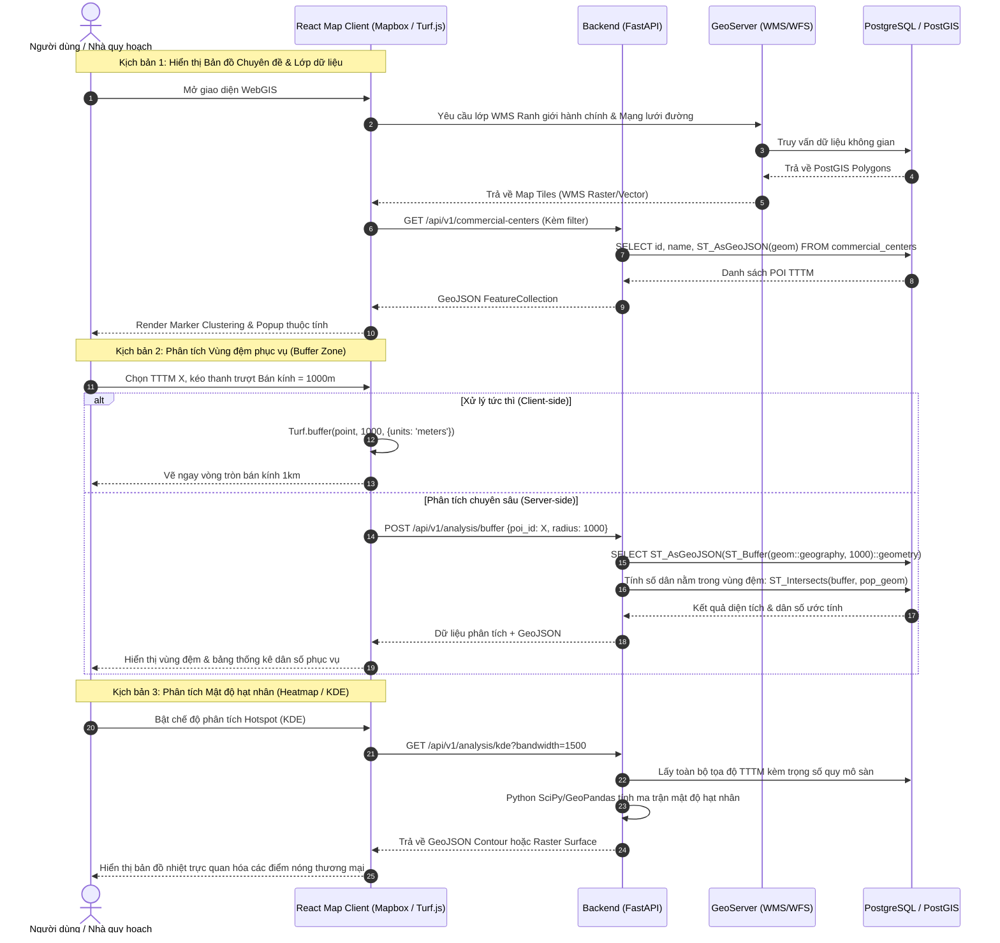

# THIẾT KẾ KIẾN TRÚC HỆ THỐNG WEBGIS 3 LỚP
## (3-TIER URBAN SPATIAL ANALYSIS WEBGIS ARCHITECTURE)

---

### 1. TỔNG QUAN KIẾN TRÚC (HIGH-LEVEL OVERVIEW)

Hệ thống **WebGIS phân tích không gian đô thị** được xây dựng theo mô hình kiến trúc 3 lớp phân tán hiện đại (**3-Tier Architecture**), tuân thủ các chuẩn mở về dữ liệu địa không gian của Hiệp hội Địa không gian Mở Quốc tế (**Open Geospatial Consortium - OGC**). Mô hình này bảo đảm tính mở, tính độc lập giữa giao diện người dùng, logic tính toán không gian và tầng lưu trữ dữ liệu bền vững.

```mermaid
flowchart TB
    subgraph Tier1 ["1. PRESENTATION TIER (Web Client / Frontend)"]
        UI["React.js SPA (Vite + TailwindCSS)"]
        MapEngine["Mapbox GL JS / Leaflet (Vector & Raster Renderer)"]
        ClientGIS["Turf.js (Client-side Geoprocessing)"]
        ChartEngine["ECharts / Chart.js (Urban Statistical Dashboard)"]
        UI --> MapEngine
        UI --> ClientGIS
        UI --> ChartEngine
    end

    subgraph Tier2 ["2. APPLICATION & GEOPROCESSING TIER (Backend Services)"]
        Gateway["API Gateway / Reverse Proxy (Nginx)"]
        FastAPIService["Python FastAPI Service (Async REST APIs)"]
        GeoEngine["Spatial Analytics Core (GeoPandas / Shapely / SciPy)"]
        GeoServer["GeoServer (OGC Map Server: WMS / WFS)"]
        RoutingEngine["Accessibility / Isochrone Engine (pgRouting / OSRM)"]
        
        Gateway --> FastAPIService
        Gateway --> GeoServer
        FastAPIService --> GeoEngine
        FastAPIService --> RoutingEngine
    end

    subgraph Tier3 ["3. DATA & SPATIAL STORAGE TIER (Spatial DB & Assets)"]
        Postgres["PostgreSQL 16 + PostGIS 3.4 (Spatial Database)"]
        GIST["Spatial GiST Indexes (R-Tree Indexing)"]
        RawFiles["File Storage (GeoJSON / Shapefile / GeoTIFF)"]
        OSMData["OpenStreetMap Data (Overpass API / Geofabrik)"]
        
        Postgres --- GIST
        FastAPIService <--> Postgres
        GeoServer <--> Postgres
        GeoEngine <--> Postgres
    end

    MapEngine <-->|GeoJSON / REST HTTP| Gateway
    MapEngine <-->|WMS / WFS / Vector Tiles (MVT)| Gateway
```

---

### 2. CHI TIẾT TỪNG LỚP TRONG HỆ THỐNG (TIER BREAKDOWN)

#### 2.1. Lớp Trình diễn (Presentation Tier - Frontend)
- **Công nghệ nền tảng:** React.js (phiên bản 18+ với Vite), TypeScript/JavaScript, TailwindCSS.
- **Thư viện Bản đồ số (Map Engine):**
  - **Mapbox GL JS / MapLibre GL JS:** Hỗ trợ render WebGL tốc độ cao (60 FPS), hiển thị mượt mà hàng chục nghìn đối tượng điểm không gian (TTTM, cửa hàng), hỗ trợ Vector Tiles (MVT) và các lớp phủ chuyên đề (Choropleth map, Isochrone polygon).
  - Tùy chọn phối hợp **Leaflet:** Dành cho các chế độ xem nhẹ nhàng hoặc thiết bị di động.
- **Engine Phân tích Không gian Phía Client (Client-side GIS):**
  - **Turf.js:** Thực hiện các phép tính hình học tức thời trên trình duyệt mà không cần gọi tải lại server (Tính khoảng cách Euclid/Haversine, vẽ vùng đệm động (Dynamic Buffer Slider), tìm bao lồi (Convex Hull), tính tâm hình học (Centroid)).
- **Bảng điều khiển Thống kê Đô thị (Analytics Dashboard):**
  - **Apache ECharts / Chart.js:** Hiển thị biểu đồ phân bổ diện tích sàn thương mại theo từng quận/huyện, tháp so sánh mật độ TTTM/dân số, biểu đồ hình radar đánh giá khả năng tiếp cận dịch vụ.

#### 2.2. Lớp Ứng dụng & Xử lý Không gian (Application / Logic Tier - Backend)
- **Web API Service (Python FastAPI):**
  - FastAPI cung cấp hiệu năng bất đồng bộ (Asynchronous I/O) vượt trội, tự động sinh tài liệu Swagger/OpenAPI 3.0.
  - Xử lý các nghiệp vụ: Xác thực người dùng, CRUD dữ liệu điểm dịch vụ thương mại, lọc dữ liệu theo bộ lọc đa chiều (bán kính, loại hình TTTM, đơn vị hành chính).
- **Lõi Phân tích Không gian Chuyên sâu (Spatial Analytics Core):**
  - Tận dụng hệ sinh thái khoa học dữ liệu địa lý mạnh mẽ của Python:
    - **GeoPandas & Shapely:** Xử lý vector geometry, Spatial Join (gán TTTM vào ranh giới quận huyện), Overlay analysis.
    - **SciPy & Scikit-learn:** Cài đặt giải thuật ước lượng mật độ hạt nhân (**Kernel Density Estimation - KDE**) để sinh bản đồ nhiệt (Heatmap raster/contour), giải thuật gom cụm không gian (**DBSCAN, K-Means Clustering**).
    - **Voronoi Diagram Generator:** Sinh đa giác Thiessen để xác định ranh giới cạnh tranh không gian giữa các trung tâm thương mại lân cận.
- **Máy chủ Bản đồ OGC (OGC Map Server - GeoServer):**
  - Phục vụ các chuẩn bản đồ mở quốc tế:
    - **WMS (Web Map Service):** Render bản đồ dạng ảnh PNG/JPEG tiles từ PostGIS giúp giảm tải cho client khi hiển thị lớp ranh giới hoặc giao thông phức tạp.
    - **WFS (Web Feature Service):** Cung cấp dữ liệu vector thô (GeoJSON/GML) để client có thể tương tác chọn, lọc và chỉnh sửa thuộc tính.
    - **GeoWebCache:** Tối ưu hóa bộ nhớ đệm tile bản đồ.

#### 2.3. Lớp Dữ liệu & Lưu trữ Không gian (Data & Storage Tier)
- **Hệ quản trị CSDL Không gian: PostgreSQL 16 + PostGIS 3.4:**
  - Định dạng chuẩn lưu trữ hình học: `geometry(Point, 4326)` và `geometry(MultiPolygon, 4326)`.
  - Hệ quy chiếu không gian (Spatial Reference System - SRS):
    - **EPSG:4326 (WGS 84):** Chuẩn lưu trữ tọa độ kinh/vĩ độ toàn cầu (dùng cho GeoJSON và Web Client).
    - **EPSG:3857 (Web Mercator):** Chuẩn chiếu cho bản đồ trực tuyến (Google Maps, OpenStreetMap).
    - **EPSG:3405 / EPSG:3406 (VN-2000 TP. Hà Nội):** Dùng khi cần tính diện tích và khoảng cách trắc địa chính xác tuyệt đối theo mét chuẩn Việt Nam.
  - **Tối ưu hóa Truy vấn Không gian:** Đánh chỉ mục không gian **Spatial GiST (Generalized Search Tree)** trên tất cả các cột tọa độ hình học, tăng tốc độ truy vấn `ST_DWithin`, `ST_Intersects`, `ST_Contains` lên gấp 50-100 lần.

---

### 3. LUỒNG DỮ LIỆU ĐẶC THÙ (SPATIAL WORKFLOW & DATA FLOW)



---

### 4. ĐẶC TẢ CƠ SỞ DỮ LIỆU KHÔNG GIAN (SPATIAL SCHEMA DESIGN)

#### 4.1. Bảng `commercial_centers` (Các trung tâm thương mại & siêu thị lớn)
```sql
CREATE TABLE commercial_centers (
    id SERIAL PRIMARY KEY,
    name VARCHAR(255) NOT NULL,
    brand VARCHAR(100),              -- Ví dụ: Vincom, Aeon Mall, Lotte, Big C / GO!
    type VARCHAR(50),               -- shopping_mall, department_store, supermarket
    floor_area NUMERIC(10, 2),      -- Diện tích sàn xây dựng (m2)
    levels INT,                     -- Số tầng kinh doanh
    parking_capacity INT,           -- Sức chứa bãi đỗ xe
    opening_hours VARCHAR(100),     -- Giờ mở cửa
    address TEXT,                   -- Địa chỉ chi tiết
    district_code VARCHAR(20),      -- Mã quận/huyện
    geom GEOMETRY(Point, 4326),     -- Tọa độ vị trí địa lý (WGS84)
    created_at TIMESTAMP DEFAULT CURRENT_TIMESTAMP
);

-- Tạo chỉ mục không gian bắt buộc
CREATE INDEX idx_commercial_centers_geom ON commercial_centers USING GIST (geom);
```

#### 4.2. Bảng `districts` (Ranh giới hành chính quận/huyện)
```sql
CREATE TABLE districts (
    district_code VARCHAR(20) PRIMARY KEY,
    name VARCHAR(100) NOT NULL,
    population INT,                 -- Dân số (người)
    area_km2 NUMERIC(10, 2),        -- Diện tích tự nhiên (km2)
    density_per_km2 NUMERIC(10, 2), -- Mật độ dân số (người/km2)
    geom GEOMETRY(MultiPolygon, 4326)
);

CREATE INDEX idx_districts_geom ON districts USING GIST (geom);
```

#### 4.3. Bảng `service_buffers` (Vùng đệm lưu vết phân tích)
```sql
CREATE TABLE service_buffers (
    id SERIAL PRIMARY KEY,
    center_id INT REFERENCES commercial_centers(id) ON DELETE CASCADE,
    radius_meters INT NOT NULL,     -- 500, 1000, 3000, 5000
    covered_population INT,         -- Dân số ước tính được bao phủ
    geom GEOMETRY(Polygon, 4326)
);

CREATE INDEX idx_service_buffers_geom ON service_buffers USING GIST (geom);
```

---

### 5. CÁC CÔNG THỨC TOÁN & GIẢI THUẬT PHÂN TÍCH ĐÔ THỊ

1. **Kernel Density Estimation (KDE):**
   Mật độ phân bố tại vị trí tọa độ $x$:
   $$\hat{f}(x) = \frac{1}{n h^2} \sum_{i=1}^{n} K\left(\frac{x - x_i}{h}\right)$$
   Trong đó:
   - $h$: Bán kính làm mịn (Bandwidth/Search radius), thường chọn từ $1000m - 2000m$ trong đô thị.
   - $K$: Hàm nhân bậc 4 (Quartic kernel):
     $$K(u) = \frac{3}{\pi} (1 - u^2)^2 \quad \text{với } |u| \le 1$$

2. **Vùng đệm không gian (Spatial Buffer):**
   Tập hợp tất cả các điểm $p$ có khoảng cách trắc địa tới tập điểm TTTM $S$ nhỏ hơn hoặc bằng bán kính $R$:
   $$\text{Buffer}(S, R) = \{ p \in \mathbb{R}^2 \mid \exists s \in S, \text{dist}(p, s) \le R \}$$

3. **Đa giác Voronoi (Thiessen Polygons):**
   Xác định vùng không gian ảnh hưởng cạnh tranh mà mọi điểm trong đa giác đều gần TTTM $s_i$ hơn bất kỳ TTTM $s_j$ nào khác:
   $$V(s_i) = \{ p \in \mathbb{R}^2 \mid \text{dist}(p, s_i) < \text{dist}(p, s_j), \forall j \neq i \}$$
